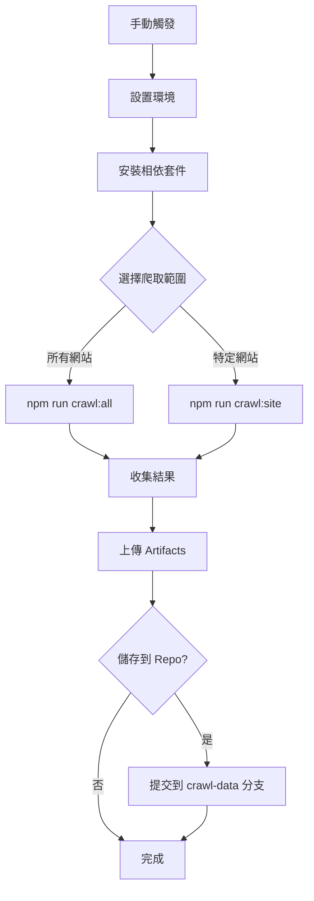

# GitHub Action 使用說明

## 概述

這個 GitHub Action 可以讓您手動觸發 AI News Crawler，執行爬蟲並將結果儲存在 GitHub Action 的 artifacts 中。

## 功能特色

- ✅ **手動觸發**：透過 GitHub 介面手動執行
- ✅ **彈性選擇**：可選擇爬取特定網站或所有網站
- ✅ **雙重儲存**：支援 Artifacts 和 Repository 兩種儲存方式
- ✅ **詳細日誌**：完整的執行過程記錄
- ✅ **錯誤處理**：即使部分失敗也會保存可用結果
- ✅ **摘要報告**：自動生成執行摘要

## 如何使用

### 1. 手動觸發 Action

1. 前往您的 GitHub repository
2. 點擊 **Actions** 標籤
3. 在左側選擇 **AI News Crawler** workflow
4. 點擊 **Run workflow** 按鈕
5. 設定執行參數：
   - **Site**: 選擇要爬取的網站（空白 = 所有網站）
   - **Save to repo**: 是否同時儲存到 repository

### 2. 執行參數說明

#### Site 參數
- **空白** (預設): 執行 `npm run crawl:all`，爬取所有支援的網站
- **lmarena**: 執行 `npm run crawl:lmarena`，只爬取 LMArena

#### Save to repo 參數
- **false** (預設): 只儲存到 Action Artifacts
- **true**: 同時儲存到 repository 的 `crawl-data` 分支

## 結果儲存

### Artifacts 儲存
- **位置**: GitHub Action 執行頁面的 Artifacts 區域
- **檔案名稱**: `crawl-results-{run_number}`
- **保存期限**: 90 天
- **內容包含**:
  - `data/` 目錄下的所有爬蟲結果
  - `crawl-summary.md` 執行摘要
  - `storage/` 目錄（如果存在）

### Repository 儲存 (可選)
- **分支**: `crawl-data`
- **結構**:
  ```
  crawl-results/
  ├── latest/           # 最新結果
  │   ├── *.json
  │   └── crawl-summary.md
  └── 20250101-120000/  # 時間戳目錄
      ├── *.json
      └── crawl-summary.md
  ```

## 執行流程



## 查看結果

### 1. 下載 Artifacts
1. 前往 Action 執行頁面
2. 滾動到底部的 **Artifacts** 區域
3. 點擊 `crawl-results-{number}` 下載

### 2. 查看 Repository 結果 (如果啟用)
1. 切換到 `crawl-data` 分支
2. 瀏覽 `crawl-results/latest/` 查看最新結果
3. 或瀏覽時間戳目錄查看歷史結果

### 3. 查看執行摘要
每次執行後，Action 會在執行頁面顯示詳細的摘要報告，包含：
- 執行時間
- 觸發方式
- 爬取的網站
- 生成的檔案列表
- 快速連結

## 故障排除

### 常見問題

**Q: Action 執行失敗怎麼辦？**
A: 查看 Action 執行日誌，通常是網路問題或網站結構變更。即使失敗，部分結果仍會被保存。

**Q: 沒有生成任何檔案？**
A: 檢查爬蟲目標網站是否可訪問，或網站結構是否有變更。

**Q: Artifacts 找不到？**
A: Artifacts 有 90 天保存期限，過期會自動刪除。

**Q: 如何查看詳細的爬蟲日誌？**
A: Action 設定了 `DEBUG=1` 環境變數，會顯示詳細的除錯資訊。

### 手動除錯

如果需要本地除錯，可以：

```bash
# 設定除錯模式
export DEBUG=1

# 執行爬蟲
npm run crawl:all

# 查看結果
ls -la data/
```

## 進階設定

### 修改保存期限
在 `.github/workflows/crawl-data.yml` 中修改：
```yaml
retention-days: 90  # 改為您需要的天數
```

### 新增更多網站選項
在 workflow 檔案的 `inputs.site.options` 中新增選項。

### 自動化執行
如需定時執行，可在 workflow 中新增 `schedule` 觸發器：
```yaml
on:
  workflow_dispatch:
    # ... 現有設定
  schedule:
    - cron: '0 0 * * *'  # 每天午夜執行
